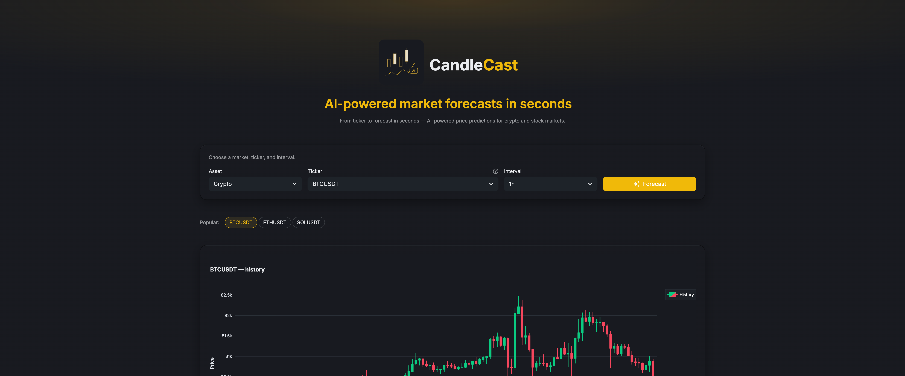

# CandleCast

AI-powered price forecasts for crypto and stocks. Pick a ticker, click **Forecast**, and watch predicted candles draw themselves onto the chart next to the real history.



## What it does

- Fetches recent OHLCV candles for any Binance crypto pair or yfinance-supported stock.
- Runs an open-source AI forecasting model over the history to generate the next N candles.
- Renders history + forecast on a single interactive Plotly chart, with a directional summary (bullish / bearish / neutral).

## Run locally

Requires Python 3.12 and [uv](https://docs.astral.sh/uv/).

```bash
uv sync
uv run streamlit run app.py --server.headless=true
```

Then open <http://localhost:8501>.

## Project layout

```
app.py                    # Streamlit UI + chart rendering
forecast.py               # Forecast model wrapper (cached singleton)
data/binance.py           # Crypto OHLCV (Binance public API)
data/yfinance_source.py   # Stock OHLCV (yfinance)
data/symbols/             # Pre-ranked ticker catalogs
scripts/refresh_symbols.py # Regenerate the crypto symbol list
```

Data fetchers return a shared normalized DataFrame (UTC-indexed, `open / high / low / close / volume` as float) so the chart and predictor consume one schema.

## Reproducibility

The underlying model is **sampling-based** — each forecast bar is drawn from a probability distribution, so the same inputs would otherwise yield a different forecast on every run. To keep results stable, `forecast.py` reseeds Python / NumPy / PyTorch RNGs to a fixed value before each prediction. Identical history in produces identical forecast out.

If the latest live bar changes between runs, the forecast will (correctly) shift — determinism is keyed to the exact input candles, not the ticker.

## Disclaimer

Forecasts are generated for research and educational purposes only. CandleCast does not provide financial advice or guarantee future price movement.
